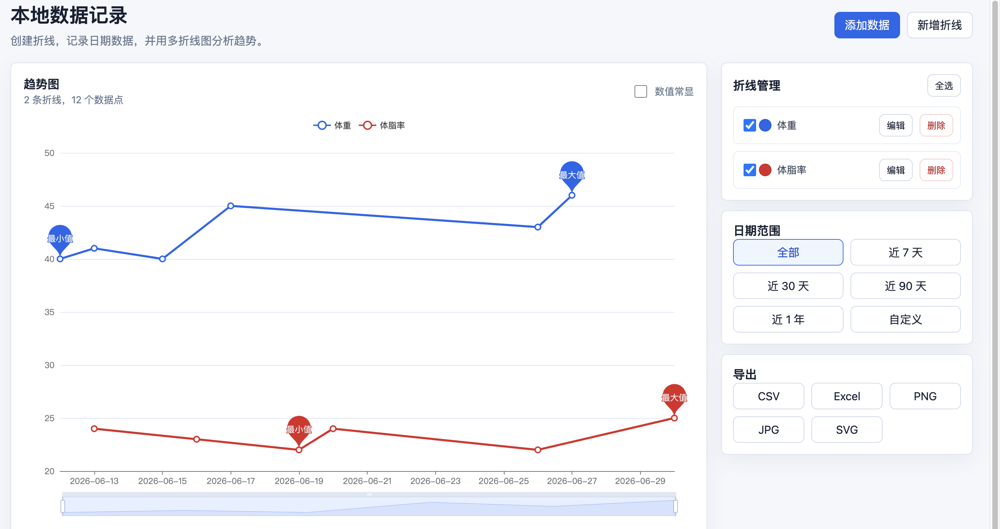

# 本地数据记录 + 多折线图分析工具

一个前后端分离的本地数据记录工具。用户可以创建多条折线，为每条折线录入按日期变化的数据，并用 ECharts 进行多折线趋势分析。

在线演示：https://line-chart-tool.onrender.com  
源码地址：https://github.com/byoneliang-arch/line-chart-tool



## 技术栈

- 前端：Vue 3、Vite、ECharts
- 后端：Flask
- 数据库：SQLite

## 目录结构

```text
.
├── backend
│   ├── app.py
│   └── requirements.txt
├── frontend
│   ├── index.html
│   ├── package.json
│   ├── vite.config.js
│   └── src
│       ├── App.vue
│       ├── main.js
│       ├── style.css
│       ├── services
│       │   └── api.js
│       └── utils
│           └── date.js
└── README.md
```

## 数据库设计

SQLite 数据库会在后端第一次启动时自动初始化，文件路径为 `backend/data/records.db`。

### lines

| 字段 | 类型 | 说明 |
| --- | --- | --- |
| id | INTEGER PRIMARY KEY AUTOINCREMENT | 折线 ID |
| name | TEXT NOT NULL | 折线名称 |
| color | TEXT NOT NULL | 折线颜色 |
| created_at | TEXT NOT NULL | 创建时间 |

### data_points

| 字段 | 类型 | 说明 |
| --- | --- | --- |
| id | INTEGER PRIMARY KEY AUTOINCREMENT | 数据点 ID |
| line_id | INTEGER NOT NULL | 所属折线 |
| date | TEXT NOT NULL | 日期，YYYY-MM-DD |
| value | REAL NOT NULL | 数值 |

约束：

- `line_id` 外键关联 `lines.id`
- 删除折线会级联删除其所有数据点
- `UNIQUE(line_id, date)` 保证同一条折线同一天只有一个数据点

## 启动步骤

### 1. 启动后端

```bash
cd backend
python3 -m venv .venv
source .venv/bin/activate
pip install -r requirements.txt
python app.py
```

后端默认运行在 `http://127.0.0.1:5001`。

### 2. 启动前端

另开一个终端：

```bash
cd frontend
npm install
npm run dev
```

前端默认运行在 `http://127.0.0.1:5173`。

## 部署成网页版

项目已支持生产部署。推荐使用 Docker：

```bash
docker build -t local-line-chart-tool .
docker run -d \
  --name line-chart-tool \
  -p 5001:5001 \
  -v line-chart-data:/data \
  local-line-chart-tool
```

浏览器打开：

```text
http://127.0.0.1:5001
```

更多部署说明见 [DEPLOYMENT.md](./DEPLOYMENT.md)。

> 注意：GitHub Pages 只能托管静态页面，不能运行 Flask 后端，也不能保存 SQLite 数据。本项目可以上传到 GitHub 做代码托管和自动构建检查；如果要公开访问完整功能，仍建议部署到 VPS、云服务器或支持持久化磁盘的容器平台。

## 面试展示建议

建议展示为：

- GitHub 源码仓库：展示代码、README、CI、Dockerfile
- 在线演示地址：使用 Render / Railway / VPS 部署完整应用
- 项目截图：展示折线管理、日期筛选、图表交互和导出能力

推荐面试描述：

> 这是一个本地数据记录与多折线趋势分析工具。前端使用 Vue 3、Vite 和 ECharts 实现交互式多折线分析，后端使用 Flask 提供 REST API，SQLite 做数据持久化，并通过 Docker 支持生产部署。

## API 说明

### 折线

- `GET /api/lines`：获取全部折线
- `POST /api/lines`：新增折线
- `PUT /api/lines/:id`：更新折线名称和颜色
- `DELETE /api/lines/:id`：删除折线及其所有数据点

新增或更新折线请求体：

```json
{
  "name": "体重",
  "color": "#3b82f6"
}
```

### 数据点

- `GET /api/data-points`：获取数据点，支持 `line_ids`、`start_date`、`end_date`
- `POST /api/data-points`：新增数据点
- `PUT /api/data-points/:id`：更新数据点
- `DELETE /api/data-points/:id`：删除数据点

新增或更新数据点请求体：

```json
{
  "line_id": 1,
  "date": "2026-06-12",
  "value": 70.5,
  "overwrite": false
}
```

重复录入同一折线同一天数据时，如果 `overwrite` 不是 `true`，接口返回 `409` 和 `duplicate_data_point`。

### 数据导出

- `GET /api/export/csv`：导出 CSV
- `GET /api/export/excel`：导出 Excel

支持查询参数：

- `line_ids=1,2,3`
- `start_date=YYYY-MM-DD`
- `end_date=YYYY-MM-DD`

## 已实现功能

- 新增、删除、重命名折线，修改折线颜色
- 数据点新增、编辑、删除
- 重复日期数据点覆盖确认
- 多折线图实时刷新
- 折线显示复选框控制
- 日期范围快捷筛选和自定义筛选
- ECharts 鼠标滚轮缩放、拖动平移、区域缩放
- 最大值、最小值 markPoint
- 数值常显和悬停显示两种模式
- 当前筛选数据导出为 CSV / Excel
- 当前图表导出为 PNG / JPG / SVG

## 后续可扩展建议

- 增加数据点表格视图和批量导入
- 支持更多图表类型，例如柱状图、面积图
- 增加单位字段和目标线
- 增加本地备份、恢复和数据库迁移
- 增加 PWA 离线访问能力
